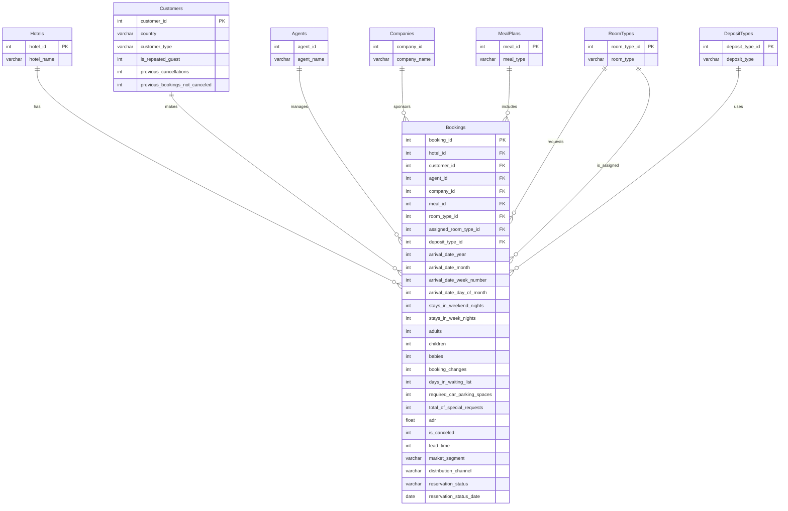

```mermaid
erDiagram
    %% Relationships
    Hotels ||--o{ Bookings : "has"
    Customers ||--o{ Bookings : "makes"
    Agents ||--o{ Bookings : "manages"
    Companies ||--o{ Bookings : "sponsors"
    MealPlans ||--o{ Bookings : "includes"
    RoomTypes ||--o{ Bookings : "requests"
    RoomTypes ||--o{ Bookings : "is_assigned"
    DepositTypes ||--o{ Bookings : "uses"

    %% Dimension Tables
    Hotels {
        int hotel_id PK
        varchar hotel_name
    }

    Customers {
        int customer_id PK
        varchar country
        varchar customer_type
        int is_repeated_guest
        int previous_cancellations
        int previous_bookings_not_canceled
    }

    Agents {
        int agent_id
        varchar agent_name
    }

    Companies {
        int company_id
        varchar company_name
    }

    MealPlans {
        int meal_id PK
        varchar meal_type
    }

    RoomTypes {
        int room_type_id PK
        varchar room_type
    }

    DepositTypes {
        int deposit_type_id PK
        varchar deposit_type
    }

    %% Fact Table
    Bookings {
        int booking_id PK
        int hotel_id FK
        int customer_id FK
        int agent_id FK
        int company_id FK
        int meal_id FK
        int room_type_id FK
        int assigned_room_type_id FK
        int deposit_type_id FK
        int arrival_date_year
        int arrival_date_month
        int arrival_date_week_number
        int arrival_date_day_of_month
        int stays_in_weekend_nights
        int stays_in_week_nights
        int adults
        int children
        int babies
        int booking_changes
        int days_in_waiting_list
        int required_car_parking_spaces
        int total_of_special_requests
        float adr
        int is_canceled
        int lead_time
        varchar market_segment
        varchar distribution_channel
        varchar reservation_status
        date reservation_status_date
    }
```