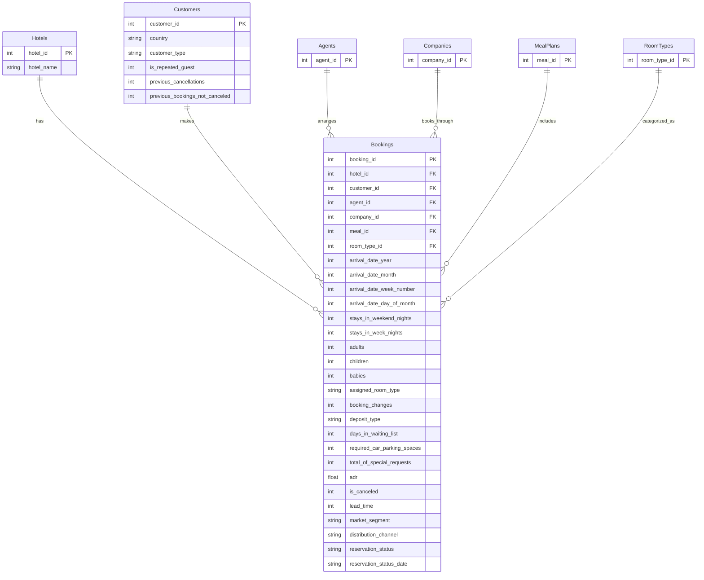

```mermaid
erDiagram
    Hotels ||--o{ Bookings : "has"
    Customers ||--o{ Bookings : "makes"
    Agents ||--o{ Bookings : "arranges"
    Companies ||--o{ Bookings : "books_through"
    MealPlans ||--o{ Bookings : "includes"
    RoomTypes ||--o{ Bookings : "categorized_as"

    Hotels {
        int hotel_id PK
        string hotel_name
    }

    Customers {
        int customer_id PK
        string country
        string customer_type
        int is_repeated_guest
        int previous_cancellations
        int previous_bookings_not_canceled
    }

    Agents {
        int agent_id PK
    }

    Companies {
        int company_id PK
    }

    MealPlans {
        int meal_id PK
    }

    RoomTypes {
        int room_type_id PK
    }

    Bookings {
        int booking_id PK
        int hotel_id FK
        int customer_id FK
        int agent_id FK
        int company_id FK
        int meal_id FK
        int room_type_id FK
        int arrival_date_year
        int arrival_date_month
        int arrival_date_week_number
        int arrival_date_day_of_month
        int stays_in_weekend_nights
        int stays_in_week_nights
        int adults
        int children
        int babies
        string assigned_room_type
        int booking_changes
        string deposit_type
        int days_in_waiting_list
        int required_car_parking_spaces
        int total_of_special_requests
        float adr
        int is_canceled
        int lead_time
        string market_segment
        string distribution_channel
        string reservation_status
        string reservation_status_date
    }
```